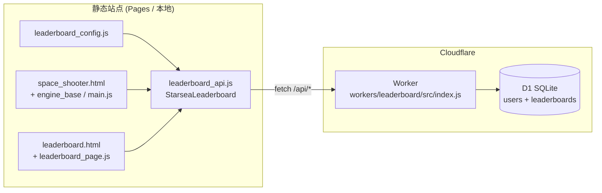

# 星海猎手 V7 全球排行榜 — Code Review

> 审查范围：Cloudflare D1 + Worker 后端、前端 SDK、排行榜页面、游戏结算联机同步  
> 审查日期：2026-06-02  
> 审查结论：**架构清晰、可上线演示；安全与运维项需在正式运营前补强**

---

## 1. 架构概览



### 数据流

| 场景 | 触发点 | 行为 |
|------|--------|------|
| 游戏破纪录 | `engine_base.js`（主线程）或 `main.js`（Worker 线程回传） | 调用 `StarseaLeaderboard.syncScoreToCloud` |
| 排行榜页加载 | `leaderboard_page.js` → `connectLiveApi()` | `/api/health` 探测 → LIVE 或 Mock |
| 手动同步 | 排行榜页「同步至云端」按钮 | `POST /api/submit-score` |
| 昵称变更 | `playerNameInput` change 事件 | 带上当前最高分 upsert |

### 涉及文件

| 文件 | 职责 |
|------|------|
| `workers/leaderboard/src/index.js` | Worker HTTP API |
| `workers/leaderboard/schema.sql` | D1 表结构 |
| `workers/leaderboard/wrangler.toml` | 部署与 D1 绑定 |
| `js/leaderboard_config.js` | `apiBase`、开关配置 |
| `js/leaderboard_api.js` | 公共 SDK（health / fetch / submit） |
| `js/leaderboard_page.js` | 排行榜页 UI 与 Mock 回退 |
| `leaderboard.html` | 排行榜页面 |
| `js/engine_base.js` | 主线程模式 gameOver 同步 |
| `js/main.js` | Worker 模式 gameOver 同步 |
| `js/game_worker.js` | 子线程计算 `isNewBest` 并 postMessage |

---

## 2. API 接口

**Base URL：** `js/leaderboard_config.js` 中的 `apiBase`  
当前配置：`https://e92c11bf-8429-471d-93ea-9fe086c3b3f5.842695824.workers.dev`

| 路径 | 方法 | 说明 |
|------|------|------|
| `/api/health` | GET | 探测服务 + D1 连通性 |
| `/api/leaderboard?limit=50` | GET | Top N 排行榜（limit 1–50） |
| `/api/player?user_id=usr_xxx` | GET | 单个玩家分数与排名 |
| `/api/submit-score` | POST | 提交/更新最高分 |

**POST Body 示例：**

```json
{
  "user_id": "usr_abc123456789",
  "username": "星海先驱者",
  "score": 12850,
  "ship_type": "void"
}
```

**校验规则（服务端）：**

- `user_id`：`/^usr_[a-z0-9]{8,32}$/`
- `username`：去 XSS 字符，最长 12
- `score`：0–999999999 整数
- `ship_type`：`default | void | thunder | imperial`

---

## 3. 优点（做得好的地方）

### 3.1 前后端分层清晰

- 配置（config）、SDK（api）、页面逻辑（page）三者分离，游戏侧只依赖 `StarseaLeaderboard` 薄接口。
- Worker 单文件实现四个端点，无过度抽象，适合当前规模。

### 3.2 安全渲染

排行榜列表使用 `textContent` / `createElement` 渲染用户名与分数，昵称在客户端和服务端双重 `sanitize`，有效避免 XSS。

```356:358:js/leaderboard_page.js
            const userName = document.createElement('span');
            userName.className = 'user-name';
            userName.textContent = record.username || '未知飞行员';
```

### 3.3 服务端「只涨不降」

D1 upsert 使用 `CASE WHEN excluded.score > leaderboards.score`，防止低分覆盖高分，逻辑正确。

```178:181:workers/leaderboard/src/index.js
    ON CONFLICT(user_id) DO UPDATE SET
      score = CASE WHEN excluded.score > leaderboards.score THEN excluded.score ELSE leaderboards.score END,
      ship_type = CASE WHEN excluded.score > leaderboards.score THEN excluded.ship_type ELSE leaderboards.ship_type END,
      updated_at = CASE WHEN excluded.score > leaderboards.score THEN datetime('now') ELSE leaderboards.updated_at END
```

### 3.4 Mock 回退设计合理

- API 不可达时自动降级 Mock，UI 明确区分 `LIVE · Cloudflare D1` 与 `OFFLINE · Mock`。
- 模拟结算默认**不写入** localStorage，避免演示污染真实存档。

### 3.5 双线程模式无重复同步

- **Worker 模式**：`game_worker.js` → `main.js` 收到 `isNewBest` 后同步；子线程无 `window`，不会双发。
- **主线程降级**：仅 `engine_base.js` 在破纪录时同步。

### 3.6 CORS 实现完整

正确处理 `OPTIONS` 预检，`ALLOWED_ORIGINS` 支持 `*` 与白名单两种模式。

---

## 4. 问题清单

### 🔴 高优先级

#### H-1：提交接口无鉴权，分数可被伪造

`POST /api/submit-score` 仅校验 `user_id` 格式，不验证请求是否来自真实游戏对局。任意站点、脚本或 curl 均可刷分。

**影响：** 排行榜公信力丧失。  
**建议：**

- 短期：Cloudflare Rate Limiting + Turnstile（提交前人机验证）
- 中期：服务端记录「可验证对局摘要」（wave、时长、checksum），或 HMAC 签名（密钥放 Worker Secret）
- 长期：服务端权威计分（游戏逻辑上云或 replay 校验）

#### H-2：`ALLOWED_ORIGINS = "*"` 已全开

当前 `wrangler.toml` 允许任意 Origin 跨域调用，配合 H-1 风险更大。

**建议：** 生产环境改回域名白名单：

```toml
ALLOWED_ORIGINS = "https://renlimeng.qzz.io,https://rlmbest.xyz"
```

#### H-3：无 Rate Limiting

`/api/submit-score` 和 `/api/leaderboard` 均无频率限制，易被 DDoS 或批量刷库。

**建议：** 使用 Cloudflare WAF / Rate Limiting Rules，或在 Worker 内用 KV 做 per-IP 滑动窗口。

---

### 🟡 中优先级

#### M-1：`useSameOriginApi` 配置项未生效

`leaderboard_config.js` 声明了 `useSameOriginApi`，但 `leaderboard_api.js` 从未读取该字段。  
当前行为：`apiBase` 为空时 `buildUrl` 直接返回相对路径 `/api/*`，与注释描述一致，但开关形同虚设。

**建议：** 删除该配置项，或在 `checkHealth` 中实现：

```javascript
if (!getApiBase() && cfg.useSameOriginApi === false) return false;
```

#### M-2：`package.json` 与 `wrangler.toml` 数据库名不一致

```json
"db:init": "wrangler d1 execute starsea-leaderboard --remote --file=./schema.sql"
```

`wrangler.toml` 实际 `database_name = "e92c11bf-8429-471d-93ea-9fe086c3b3f5"`。  
执行 `npm run db:init` 可能操作错误的数据库或报错。

**建议：** 统一为 `wrangler.toml` 中的 `database_name`。

#### M-3：排名 tie-break 不一致

- 排行榜列表：`ORDER BY score DESC, updated_at ASC`
- 个人排名：`COUNT(*) + 1 WHERE score > ?`（同分者排名相同，但未考虑 `updated_at`）

同分玩家在个人排名与榜单序号上可能出现 1 位偏差。

**建议：** 排名 SQL 与榜单排序规则保持一致（同分按 `updated_at ASC` 或 `user_id` 次序）。

#### M-4：历史 `user_id` 可能不符合服务端正则

客户端 `ensureUserId()` 不校验已存 ID；若 localStorage 中有旧格式 ID，提交会返回 `400 invalid user_id`。

**建议：** 读取时校验，不合法则重新生成并迁移（或提示用户）。

```javascript
const USER_ID_RE = /^usr_[a-z0-9]{8,32}$/;
if (!USER_ID_RE.test(userId)) { /* regenerate */ }
```

#### M-5：昵称变更会提交 score=0 的新记录

修改昵称时调用 `submitScoreToBackend(localNickname, localBestScore, localSkin)`。若本地从未玩过（`localBestScore = 0`），仍会在 D1 创建 score=0 的 leaderboard 行。

**建议：** score 为 0 时仅更新 `users` 表，跳过 `leaderboards` insert；或前端判断 `localBestScore > 0` 才提交。

#### M-6：缺少 `.gitignore`

`workers/leaderboard/node_modules/` 与 `.wrangler/` 可能被误提交。

**建议：** 项目根或 worker 目录添加：

```
workers/leaderboard/node_modules/
workers/leaderboard/.wrangler/
```

---

### 🟢 低优先级 / 改进建议

#### L-1：全站导航链接不完整

目前仅 `space_shooter.html` 有 `leaderboard.html` 入口；`v7_hangar.html`、`game_manual.html` 等页面未链接。

#### L-2：文档 Tab 示例代码过时

`leaderboard.html` 内嵌示例仍写 `starsea-leaderboard.<your-account>.workers.dev`，与实际 UUID Worker 名不一致，易误导。

#### L-3：`upsertScore` 非原子事务

`users` 与 `leaderboards` 两次写入未包在 D1 batch/transaction 中；极端情况下可能 users 有记录而 leaderboards 写入失败（概率低）。

#### L-4：POST Body 无大小限制

恶意超大 JSON 可能消耗 Worker 内存。建议限制 `Content-Length` 或在读取前检查。

#### L-5：Worker 名称使用 UUID

`e92c11bf-8429-471d-93ea-9fe086c3b3f5` 可读性差。可在 `wrangler.toml` 改为 `starsea-leaderboard`（需重新部署并更新 `apiBase`）。

#### L-6：游戏同步失败无用户反馈

`syncScoreToCloud` 失败仅 `console.warn`，玩家无 UI 提示。可考虑 gameOver 屏角标「云端同步失败，请至排行榜页手动同步」。

#### L-7：`createRankNode` 奖牌使用 `innerHTML`

内容为静态 Font Awesome 类名，当前安全；若未来动态化需改回 DOM API。

---

## 5. 数据库 Schema 评估

```sql
users(id PK, username, is_guest, created_at)
leaderboards(user_id PK FK, score, ship_type, updated_at)
idx_leaderboards_score ON leaderboards(score DESC)
```

| 项 | 评价 |
|----|------|
| 表结构 | 简洁够用，符合「匿名 guest + 最高分」模型 |
| 外键 | `ON DELETE CASCADE` 合理 |
| 索引 | 分数降序索引支持 Top N 查询 |
| 缺失 | 无 `last_ip` / `submit_count` 等反作弊字段；无 audit log 表 |

---

## 6. 配置与部署检查清单

- [x] Worker 已部署，`apiBase` 已填入真实 URL
- [x] D1 表已初始化（`schema.sql`）
- [x] `ALLOWED_ORIGINS` 已配置（当前为 `*`，建议收紧）
- [ ] `npm run db:init` 脚本 database 名称与 `wrangler.toml` 对齐
- [ ] 添加 `.gitignore` 排除 `node_modules` / `.wrangler`
- [ ] 生产环境启用 Rate Limiting
- [ ] 验证 `/api/health` 返回 `{"ok":true}`

**本地开发：**

```bash
cd workers/leaderboard
npm install
npm run db:init:local
npm run dev          # http://127.0.0.1:8787
```

**远程部署：**

```bash
npx wrangler login
npm run db:init      # 修正 database 名后执行
npm run deploy
```

---

## 7. 测试建议

| 用例 | 预期 |
|------|------|
| `/api/health` | 200 + `{ ok: true }` |
| 首次提交新 user_id | 创建 users + leaderboards，`updated: true` |
| 提交低于历史最高的分 | `updated: false`，D1 分数不变 |
| 非法 user_id | 400 `invalid user_id` |
| 排行榜页 API 可达 | 状态栏 LIVE，榜单来自 D1 |
| 排行榜页 API 不可达 | OFFLINE + Mock，演示横幅可见 |
| 模拟结算未勾选本地写入 | localStorage 不变 |
| Worker 模式破纪录 | main.js 触发一次 sync |
| 主线程模式破纪录 | engine_base.js 触发一次 sync |
| 修改昵称（score=0） | 不应产生无效榜位（当前有 M-5 问题） |

---

## 8. 优先修复路线图

| 阶段 | 任务 | 工作量 |
|------|------|--------|
| **P0** | 收紧 `ALLOWED_ORIGINS` | 5 min |
| **P0** | 修复 `package.json` db:init 数据库名 | 5 min |
| **P0** | 添加 `.gitignore` | 5 min |
| **P1** | user_id 本地校验与迁移 | 30 min |
| **P1** | score=0 时不写 leaderboards | 30 min |
| **P1** | 排名 tie-break 统一 | 1 h |
| **P2** | Cloudflare Rate Limiting | 1 h |
| **P2** | 删除或实现 `useSameOriginApi` | 15 min |
| **P3** | 提交签名 / Turnstile 反作弊 | 1–2 d |
| **P3** | 全站导航补排行榜入口 | 30 min |

---

## 9. 总结

本次联机排行榜实现**功能完整、结构合理**，从前端 SDK 到 D1 存储的 happy path 已打通，Mock 回退与 UI 状态设计成熟，XSS 防护到位。

主要风险集中在**信任模型**：当前完全依赖客户端诚实提交，且无频率限制、CORS 全开。作为演示 / 内测完全可用；若面向公开运营，建议至少完成 **P0 + P1 + Rate Limiting**，再逐步引入反作弊。

---

*文档由 Code Review 自动生成，如有架构变更请同步更新本文档。*

## 10. 2026-06-02 修复记录

已修复：

- 收紧 `ALLOWED_ORIGINS`，移除生产默认 `*`。
- 增加 D1-backed per-IP rate limiting，覆盖 `/api/leaderboard` 与 `/api/submit-score`。
- 修复 `useSameOriginApi` 开关、旧 `user_id` 校验与重新生成。
- 修复零分昵称同步写入 leaderboard 的问题。
- 统一个人排名与榜单排序 tie-break。
- 增加 POST `Content-Length` 上限检查。
- 使用 D1 `batch()` 包住用户与榜单写入，降低部分写入风险。
- 修复 D1 初始化脚本数据库名、补 `.gitignore`、更新页面部署示例。
- 给主要站内页面补排行榜入口。
- 将游戏结束云同步失败暴露为 toast 反馈。

仍需产品/平台层决策：

- H-1 的“真实对局鉴权”无法由纯静态客户端彻底证明。当前已通过 CORS、请求体限制、D1 频率限制降低滥用面；正式公开运营前仍建议接入 Turnstile、replay 校验或服务端权威计分。
